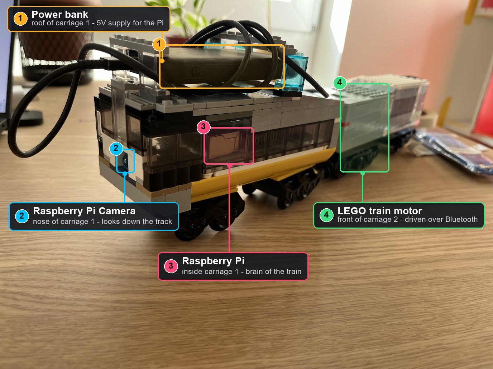

# Autonomous LEGO Train Project

This project implements an autonomous LEGO train using Raspberry Pi, camera vision, and Bluetooth controls.

## Hardware Overview

Here's an annotated view of our LEGO train showing the key components:



### Component Breakdown

The numbers match the badges on the photo above:

| # | Component           | Location                                                | Description                                                                                      |
| - | ------------------- | ------------------------------------------------------- | ------------------------------------------------------------------------------------------------ |
| 1 | Power bank          | On the roof of the first carriage                       | Portable 5V supply for the Raspberry Pi, so the train runs untethered                            |
| 2 | Raspberry Pi Camera | In the nose of the first carriage                       | Looks down the track ahead and feeds frames to the Pi for autonomous navigation                  |
| 3 | Raspberry Pi        | Inside the first carriage (visible through the windows) | The brain of the train - runs the Python code, processes camera frames, and sends motor commands |
| 4 | LEGO train motor    | Front half of the second carriage                       | Drives the train forward and backward, controlled over Bluetooth from the Raspberry Pi           |

The annotated image is generated from the original photo by [`tools/data_collection/annotate_train.py`](./tools/data_collection/annotate_train.py) - edit the coordinates in that script and re-run it to adjust the labels:

```bash
python tools/data_collection/annotate_train.py
```

## Project Structure

```
src/
  bluetooth_controller.py     # Bluetooth controller for LEGO motors

scripts/                      # Development & utility scripts
  benchmark_traffic_light.py  # Benchmark detection model against curated runs

tools/                        # All project scripts
  data_collection/            # Camera data capture scripts
  labeling/                   # Label Studio setup and configs
  hf_upload/                  # HuggingFace dataset upload/download

reports/                      # Generated benchmark reports
  benchmark_report.json       # Machine-readable benchmark results
  benchmark_report.md         # Human-readable benchmark summary

data/                         # Data pipeline directories
  captured/raw/               # Raw video/image runs from the Pi
  curated/                    # Curated/filtered runs ready for labeling
  labeled/                    # Labeled datasets (ready for HF upload)

datasets/                     # Local dataset storage (synced to HF)
tests/                        # Unit tests (reserved for future)
README.md                     # This file
.clinerules                   # Project documentation and guidelines
```

> For detailed documentation on the data pipeline, see [tools/README.md](./tools/README.md).

## Virtual Environment

This project uses a Python virtual environment located at `.venv`. All development and package installations should be done within this environment.

To activate the virtual environment:

- **Windows**: `.venv\Scripts\activate`
- **Linux/Mac**: `source .venv/bin/activate`

If the `.venv` directory doesn't exist, it should be created using `python -m venv .venv`.

## Getting Started

### 1. Prerequisites

- Python 3.x installed on development machine
- Bluetooth support enabled
- Raspberry Pi with SSH access (hostname: `levpi`)

### 2. Install Required Packages

First, activate the virtual environment:

```bash
# On Windows
.venv\Scripts\activate

# On Linux/Mac
source .venv/bin/activate
```

Then install required packages on your **development machine** (Windows, Linux, or Mac):

```bash
pip install bleak
pip install opencv-python       # Full OpenCV with GUI support (needed for imshow on the dev host)
pip install pillow              # Only needed to regenerate the annotated photo
```

> **Note:** `opencv-python` and `opencv-python-headless` are **mutually exclusive** — do **not** install both. Choose one based on your platform:
>
> | Platform | Package | Why |
> |----------|---------|-----|
> | **Development host** (Windows / Linux / Mac) | `opencv-python` | Needs GUI backend for `cv2.imshow()` on the dev machine |
> | **Raspberry Pi** | `opencv-python-headless` | No display needed; lighter weight |

### 3. Camera Setup

Before using the camera, make sure:

1. The Pi Camera Module is properly connected to the CSI port
2. Camera is enabled on Raspberry Pi (`raspi-config` -> Interface Options -> Camera)

#### Test the Camera

Run the camera smoke test to verify everything works:

```bash
# On Windows (development host)
python tools/data_collection/camera_smoke_test.py

# On Raspberry Pi (via SSH)
ssh lev@levpi
cd ~/lego-train
source .venv/bin/activate
python tools/data_collection/camera_smoke_test.py
```

The test will:

- Open the camera and display a live preview
- Show resolution and FPS information
- Capture a screenshot automatically after 5 seconds
- Save it to `data/captured/raw/screenshot.png`

### 4. Bluetooth Controller

The Bluetooth controller connects to the LEGO train motor via Bluetooth. Here's how to use it:

```python
from src.bluetooth_controller import BluetoothController

# Create a controller instance
controller = BluetoothController()

# Connect to the LEGO motor
controller.connect()

# Control the motors
speed = 50  # 0-100
controller.set_speed(speed)
controller.forward()
controller.reverse()
controller.stop()

# Disconnect when done
controller.disconnect()
```

### 5. Data Collection

Capture camera data for training your autonomous navigation model:

```bash
# Start a camera recording session
python tools/data_collection/capture_run.py

# Annotate the train components (if needed)
python tools/data_collection/annotate_train.py
```

### 6. Labeling

Use Label Studio to annotate your curated frames. You can **auto-generate tasks** with a script, or set them up **manually** in Label Studio — whichever you prefer. The quick way uses `generate_tasks.py`:

```bash
# Step 1: Generate Label Studio tasks from curated data (auto-creates the task JSON)
python tools/labeling/generate_tasks.py --dataset-path "data/curated/<run-name>"

# Step 2: Start Label Studio (it auto-serves local files for imported images)
python tools/labeling/start_label_studio.py

# Step 3: Open your browser and navigate to the URL shown
```

#### Option A: Auto-generated tasks (via `generate_tasks.py`)

1. **Create a new project** — go to Projects → New Project
2. **Paste the config XML** — in the "Configuration" tab, switch to the code editor (`</>` icon) and paste the contents of [`tools/labeling/label_studio_config.xml`](./tools/labeling/label_studio_config.xml) directly into the config editor. There's no file import option for configs — copy-paste is the intended workflow.
3. **Configure data source** — in "Data Import", upload the JSON file generated by `generate_tasks.py` (default: `tools/labeling/tasks_label_studio.json`)
4. **Set up local storage** — go to Settings → Cloud Storage → Add Source Storage → Local Files, and set the path to point at your project root so Label Studio can serve images from `data/curated/`
5. **Start labeling!**

> The `generate_tasks.py` script reads frames from `data/curated/<run-name>/frames/` and creates a ready-to-import Label Studio task file automatically. It supports frame sampling (`--frame-interval`) and limiting total frames (`--max-frames`).

#### Option B: Manual task setup (no script needed)

If you'd rather skip `generate_tasks.py`, you can import your frames directly into Label Studio:

1. **Create a new project** — go to Projects → New Project
2. **Paste the config XML** — in the "Configuration" tab, switch to the code editor (`</>` icon) and paste the contents of [`tools/labeling/label_studio_config.xml`](./tools/labeling/label_studio_config.xml) directly into the config editor. There's no file import option for configs — copy-paste is the intended workflow.
3. **Configure data source** — in "Data Import", change the source type to **"Directory"**. Set the path to your curated folder, e.g. `data/curated/<run-name>/frames/`. Label Studio will read all images from that folder as individual tasks.
4. **Set up local storage** — go to Settings → Cloud Storage → Add Source Storage → Local Files, and set the path to point at your project root so Label Studio can serve images from `data/curated/`
5. **Start labeling!**

> This approach is simpler if you're working with a single run of frames. Use `generate_tasks.py` when you want more control (frame sampling, metadata injection, handling multiple runs in one project).

### 7. Upload to HuggingFace

Upload your labeled datasets to HuggingFace Hub:

```bash
# Upload a dataset
python tools/hf_upload/upload_dataset.py --dataset_id your-username/lego-train-data

# Download a dataset
python tools/hf_upload/download_dataset.py --dataset_id your-username/lego-train-data
```

## Running the Autonomous Train

To run the full autonomous navigation pipeline on the Raspberry Pi:

```bash
ssh lev@levpi
cd ~/lego-train
source .venv/bin/activate
python src/main.py
```

The main script will:

1. Initialize the camera
2. Start the Bluetooth controller
3. Begin processing camera frames for track detection
4. Send motor commands based on visual feedback

## Benchmarking

Evaluate your traffic-light detection model against a curated video run:

```bash
# Activate the virtual environment first
source .venv/bin/activate   # Linux/Mac
# .venv\Scripts\activate   # Windows

# Run benchmark (defaults to first run in data/labeled/)
python scripts/benchmark_traffic_light.py

# Benchmark a specific run
python scripts/benchmark_traffic_light.py --dataset-dir data\labeled\LEGO-Train-Traffic-Lights

# Quick dry run (first 5 frames only)
python scripts/benchmark_traffic_light.py --dry-run
```

The script produces two reports in the `reports/` directory:

| File                              | Description                                                                  |
| --------------------------------- | ---------------------------------------------------------------------------- |
| `reports/benchmark_report.json` | Full machine-readable results (per-frame IoU, failure modes, metrics)        |
| `reports/benchmark_report.md`   | Human-readable summary with metadata (resolution, camera settings, exposure) |

The Markdown report includes session metadata (resolution, FPS, exposure time, analogue gain, HDR/NR mode) so you can correlate detection quality with camera conditions.

## Data Pipeline

The data pipeline has four stages:

1. **Capture**: Raw video/image runs from the camera (`data/captured/raw/`)
2. **Curate**: Manually copy selected runs to `data/curated/<run-name>/` — this is the subset of raw data you want to annotate
3. **Label**: Annotated datasets go to `data/labeled/` (ready for HF upload)

> **Note:** Curation (copying selected frames into `data/curated/<run-name>/`) is manual, but task generation for Label Studio is automatic — just run `generate_tasks.py` and it reads directly from your curated data. No JSON or CSV config needed.

For detailed documentation, see [tools/README.md](./tools/README.md).

## Troubleshooting

### Camera Issues

- **No camera feed**: Check that the camera is enabled (`raspi-config` -> Interface Options -> Camera)
- **Poor image quality**: Clean the camera lens and adjust focus
- **Low FPS**: Reduce camera resolution in the capture script

### Bluetooth Issues

- **Cannot connect**: Ensure the LEGO motor is powered on and in pairing mode
- **Intermittent connection**: Move the Raspberry Pi closer to the motor
- **Device not found**: Run `bluetoothctl` to scan for available devices

### Virtual Environment Issues

- **Package installation fails**: Make sure the virtual environment is activated
- **Module not found**: Reinstall packages after activating the virtual environment
- **Permission errors**: Use `pip install --user` or check file permissions

## Contributing

Feel free to submit issues and pull requests! This is a fun project for learning about:

- Computer vision with OpenCV
- Bluetooth communication with Bleak
- Raspberry Pi hardware integration
- Data collection and labeling pipelines
- Machine learning for autonomous navigation

## License

This project is open source and available for educational purposes.

## Acknowledgments

- [OpenCV](https://opencv.org/) for computer vision
- [Bleak](https://bleak.readthedocs.io/) for Bluetooth communication
- [Label Studio](https://labelstudio.ai/) for data annotation
- [HuggingFace](https://huggingface.co/) for dataset hosting
- LEGO for the amazing train set!

---

Built with love by Lev and Cline
